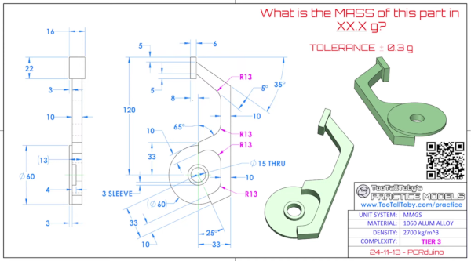

# Extremely basic geometric constraint solver

Meant for use with build123d. The project is in very early stage and constraints api is likely to change a lot. 

## Installation

pip install git+https://gitlab.com/dmytrylk/solve123d.git

## Compute values backwards from equations

You create a set of variables and impose constraints on them, then call solve() to obtain a solution. 

Example:
```py
import solve123d as cs
a = cs.var(1.2345) # 1.2345 is the initial guess
b = cs.var(1.2345)
cs.magic.zero = 2.0 - a * 3.0 + b
cs.magic.zero = a - b * 2.0 + 1.0
print(cs.solve(a)) # Will print solution for a
print(cs.solve(b)) # Will print solution for b (solution is calculated on the previous line and cached)
print(cs.solve(3.0 - a * 3.0 + b)) # You can solve for the value of an expression involving unknowns, too.
```
Expressions and the graph of variables interconnected by constraints are traced transparently behind the scenes, and the solution can be accessed through the variables you declared, rather than by indexing into large array.

This greatly simplifies use of equation solver in regular code.

If multiple solutions exist you may end up with not the solution you're looking for; if the system is overconstrained, you get least-squares solution.

## Turtle graphics + constraints for code cad sketching

You can make build123d sketches using something similar to turtle graphics, but with constraints - you can command the turtle without knowing the exact values for the command, and then impose a constraint - the turtle is smart enough to make the right moves to end up there (if possible).

For example:

```
with Turtle() as t:
    pen_up()  # Disables appending of primitives (moves work the same)
    heading(270 + 25)
    forward(33 - 10)
    pen_down()  # Start adding primitives, we start at the point that is 33-10 units away from the circle center.
    forward(10)
    left(90)
    forward()  # Move forward an unknown distance (the constraint solver will solve for the distance that meets constraints)
    t.x = 33  # Constrain turtle's x coordinate to 33 (which resolves the unknown amount above)
    heading(90)
    forward()  # Another unknown distance move
    heading(180 - 35)
    forward()  # and another
    heading(90)
    forward(5)
    heading(180)
    forward(6)
    # Now at upper left corner, whose position is known
    t.x = -8  # Two constraints for two unknown-distance moves above
    t.y = 120
...
line = t.to_build123d()
```

You can use arbitrary equations as constraints, with syntax such as:

```
(t.x*t.y).magic=5
```

to constrain turtle's position to an x*y=5 hyperbola - a turtle commanded to go forward towards this hyperbola will place it at an intersection with the hyperbola.

See the complete example in [examples/turtle_sketching.py](examples/turtle_sketching.py) , based on this TooTallToby challenge:



## Solving systems of constraints

You can also use it without build123d or turtle graphics to solve systems of geometric constraints, for example:
```py
import solve123d as cs

triangle_a = (0.0, 0.0)
triangle_b = (1.0, 0.0)
triangle_c = cs.var(0.5, 0.5) # equivalent to (cs.var(0.5), cs.var(0.5))
side_length = cs.var(0.5)
cs.distance_constraint(triangle_a, triangle_b, side_length)
cs.distance_constraint(triangle_b, triangle_c, side_length)
cs.distance_constraint(triangle_c, triangle_a, side_length)
c = cs.solve(triangle_c)
```
c will be equal to (0.5, math.sqrt(0.75))

# TODO

Some documentation

# License

Apache 2.0, see LICENSE file